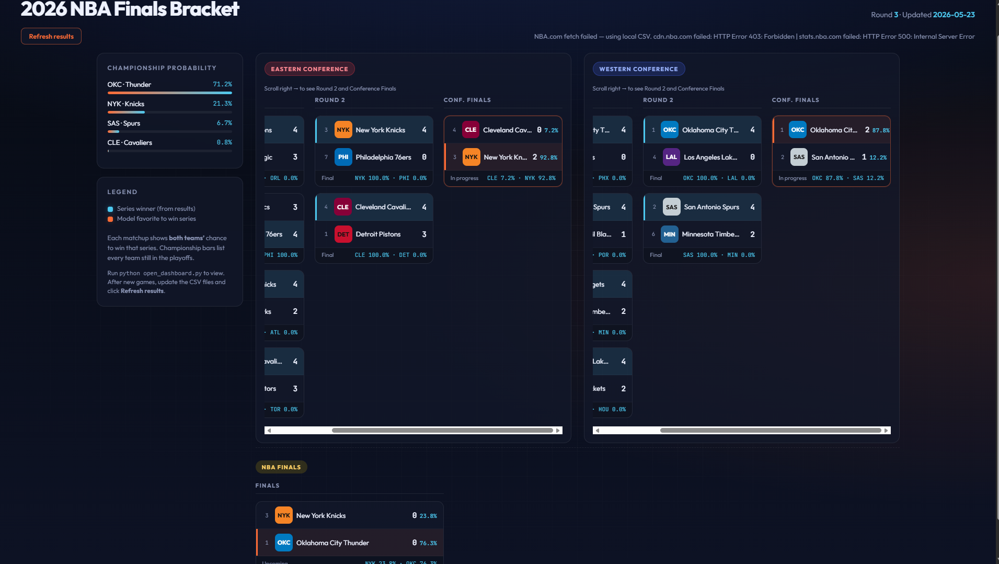
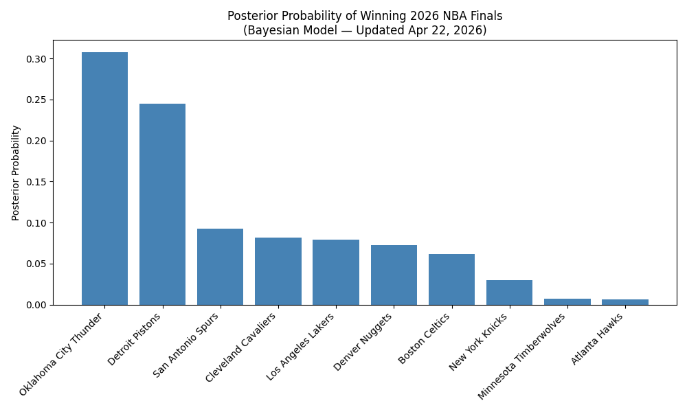
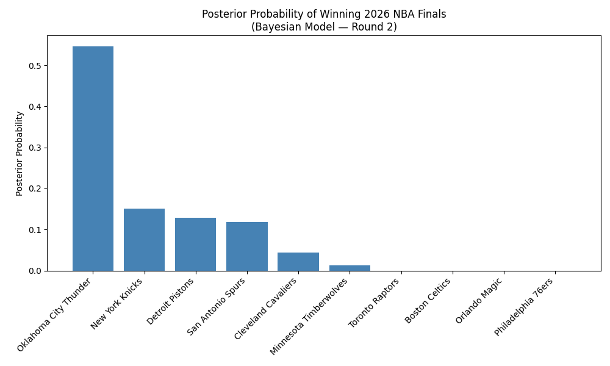
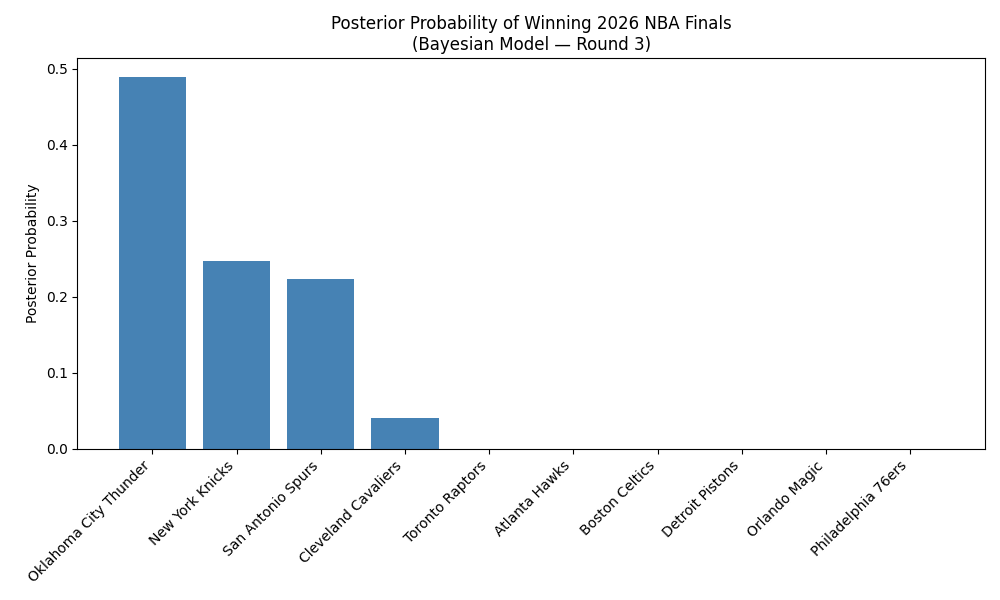

# NBA Finals 2026 Bayesian Prediction Model

A Python project that uses Bayesian inference and Monte Carlo simulation to estimate each playoff team's probability of winning the 2026 NBA Finals.

Built as a personal extension of concepts from DS-122 at Boston University. Thank you Professor Wobbes.




## Project Status

This project is being updated throughout the 2026 NBA playoffs as new results become available.

**Latest update:** May 22, 2026  
**Current stage:** Round 3 / Conference Finals

## The Idea

After learning about Bayesian updating and probability of superiority in class, I wanted to apply those ideas to something real and dynamic.

The question I wanted to explore was:

> Given what we know from the regular season and updated playoff results, how likely is each remaining team to win the Finals?

Instead of treating predictions as fixed, this project updates championship probabilities as new playoff results come in.

## How It Works

**1. Prior**

Each team starts with a strength score based on regular season win percentage and playoff seeding. This acts as the model's starting belief before incorporating playoff results.

**2. Bayesian Update**

Playoff results are used to update those prior beliefs. Teams performing better than expected receive a boost, while teams that underperform lose probability mass.

The model uses importance sampling with 20,000 Monte Carlo draws to update team strength estimates.

**3. Simulation**

The model draws 3,000 scenarios from the posterior and simulates the playoff bracket. The final probabilities are based on how often each team wins the Finals across all simulated brackets.

## Results

### Initial Results - April 22, 2026

This update used regular season data and early first-round playoff results.

| Team | Win Probability |
|---|---:|
| Oklahoma City Thunder | 31% |
| Detroit Pistons | 24% |
| San Antonio Spurs | 9.5% |
| Cleveland Cavaliers | 8.4% |
| Los Angeles Lakers | 8.1% |
| Denver Nuggets | 7.5% |
| Boston Celtics | 6.3% |
| New York Knicks | 3.0% |
| Minnesota Timberwolves | 0.7% |
| Atlanta Hawks | 0.6% |



### Round 2 Update - May 13, 2026

| Team | Win Probability |
|---|---:|
| Oklahoma City Thunder | 44.7% |
| Detroit Pistons | 11.3% |
| Boston Celtics | 10.1% |
| New York Knicks | 10.0% |
| San Antonio Spurs | 8.5% |
| Denver Nuggets | 6.1% |
| Cleveland Cavaliers | 3.0% |
| Houston Rockets | 2.4% |



### Round 3 Update - May 22, 2026

This update incorporates the latest Round 3 / Conference Finals results as of May 22, 2026.

| Team | Win Probability |
|---|---:|
| [Team 1] | 39% |
| [Team 2] | 31% |
| [Team 3] | 25% |
| [Team 4] | 4% |



## Interpretation

The model shows how championship probabilities shift as new playoff information becomes available.

The main idea is that playoff performance should update our beliefs, but not completely erase what we knew from the regular season. The Bayesian framework helps balance both sources of information.

This makes the project useful for understanding not only which team is favored, but also how uncertainty changes throughout the playoffs.

## How to Run

Install the required packages:

```bash
pip install pandas numpy matplotlib scipy
```

Run the model:

```bash
python src/main.py
```

### Bracket Dashboard


A frontend dashboard visualizes the Bayesian posterior 
probabilities in a user-friendly way. Built with HTML, CSS, and JavaScript.

View the playoff bracket and Bayesian Finals probabilities:

```bash
python open_dashboard.py
```

This opens `http://127.0.0.1:8765/dashboard.html`. Results load from your `data/round*_results.csv` files and NBA.com when available. Click **Refresh results** after updating the CSVs.

**Important:** Run `open_dashboard.py` — do not copy-paste the HTML into Chrome.

## How to Update After New Games

Update the playoff results file with the latest series scores, then rerun the model:

```bash
python src/main.py
```

The model will generate updated posterior probabilities and charts in the `outputs/` folder.


## Tech Stack

- Python
- pandas
- NumPy
- Matplotlib
- SciPy

## Course Connection

This project was inspired by a DS-122 lecture by Professor Wobbes at Boston University.

Topics applied:

- Bayesian inference
- probability of superiority
- Monte Carlo simulation
- posterior updating
- uncertainty modeling

## Limitations

- Prior weights were chosen manually rather than fit to historical playoff data
- The model does not currently account for injuries, home court advantage, rest days, or player matchups
- The model uses wins and losses rather than point differential or advanced team/player statistics
- Results are sensitive to how priors and update weights are chosen
- The model is meant as an educational and analytical project, not a betting or forecasting tool

## Future Improvements

Potential improvements include:

- Add injury and player availability data
- Include home court advantage
- Use point differential and advanced team statistics
- Fit prior weights using historical playoff data
- ~~Add an interactive dashboard~~ (see `dashboard.html` — read-only bracket view changed on May 23, 2026)
- Automate updates from live NBA data sources
